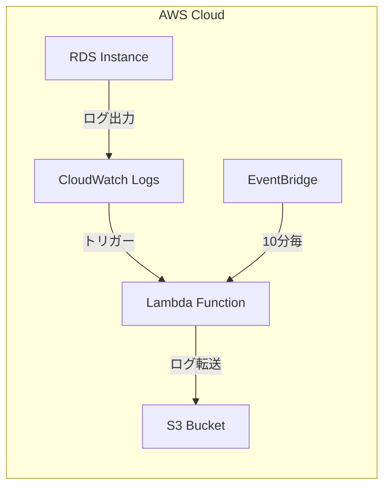

# RDS Logs Collector

RDSのログ（監査ログ、エラーログ、スロークエリログ）を自動的にS3バケットに転送するTerraformモジュールです。

## アーキテクチャ



## 機能

- RDSインスタンスから以下のログを収集してS3に転送
  - 監査ログ
  - エラーログ
  - スロークエリログ
- 10分間隔でログを収集
- ログは自動的に圧縮（gzip形式）
- CloudWatch Logsでログ監視が可能
- S3でのログ保持期間の設定が可能

## 必要要件

- Terraform 1.10.3以上
- AWS Provider 5.0以上
- Python 3.13（Lambda実行環境）

## 使用方法

```hcl
module "rds_logs_collector" {
    source                   = "../modules/rds-logs-collector"
    s3_bucket_prefix         = "my-rds-logs"
    rds_prefix               = "my-rds"
    transfer_audit_logs      = true
    transfer_error_logs      = true
    transfer_slow_query_logs = true
    log_retention_days       = 395 # 13ヶ月
}
```

## 変数

| 名前 | 説明 | タイプ | デフォルト値 |
|------|-------------|------|---------|
| s3_bucket_prefix | ログを保存するS3バケット名のプレフィックス | string | - |
| rds_prefix | 対象とするRDSインスタンス名のプレフィックス | string | - |
| transfer_audit_logs | 監査ログを転送するかどうか | bool | false |
| transfer_error_logs | エラーログを転送するかどうか | bool | false |
| transfer_slow_query_logs | スロークエリログを転送するかどうか | bool | false |
| log_retention_days | S3でのログ保持日数 | number | 395 |

## 出力値

| 名前 | 説明 |
|------|-------------|
| lambda_function_name | 作成されたLambda関数の名前 |
| s3_bucket_name | 作成されたS3バケットの名前 |
| lambda_role_arn | Lambda実行ロールのARN |

## RDS監査ログの無効化

このモジュールを使用する前に、RDSの監査ログをCloudWatch Logsへの出力を無効にする必要があります。以下のAWS CLIコマンドで設定できます：

```bash
# 監査ログのみを無効化する場合
aws rds modify-db-instance \
  --db-instance-identifier <your-db-instance-name> \
  --cloudwatch-logs-export-configuration '{"DisableLogTypes":["audit"]}' \
  --apply-immediately

# すべてのログタイプを無効化する場合
aws rds modify-db-instance \
  --db-instance-identifier <your-db-instance-name> \
  --option-group-name <your-option-group> \
  --no-enable-cloudwatch-logs-exports \
  --apply-immediately
```

**注意**: 監査ログを無効化する前に、コンプライアンス要件や監査要件を必ず確認してください。

## ライセンス

MIT
